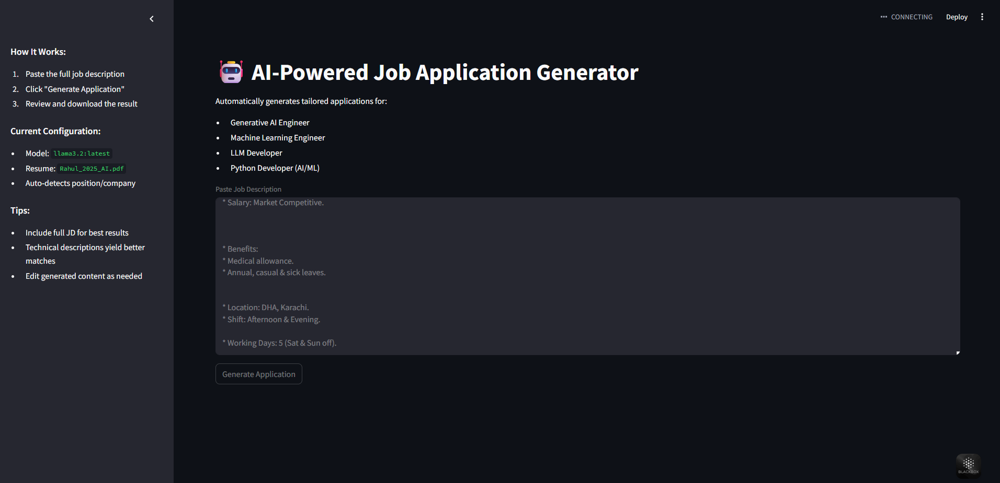

# 🚀 AI Job Application Generator

Automatically generate tailored job application emails by matching your resume with job descriptions (JDs) using open-source LLMs via Ollama.



## Features ✨

- **Smart JD Analysis**: Extracts key requirements from job descriptions
- **Resume Matching**: Identifies your most relevant experiences
- **Customized Emails**: Generates professional, role-specific applications
- **Open-Source LLMs**: Uses Mistral/Llama3 via Ollama (no API costs)
- **Streamlit UI**: User-friendly web interface

## Tech Stack 🛠️

- **Backend**: Python, Ollama
- **LLMs**: Mistral/Llama3 (via Ollama)
- **Frontend**: Streamlit
- **NLP**: Custom prompt engineering
- **Resume Parsing**: PyPDF2

## Installation 💻

1. **Install Ollama**:
   ```bash
   curl -fsSL https://ollama.com/install.sh | sh
   ollama pull mistral:7b-instruct